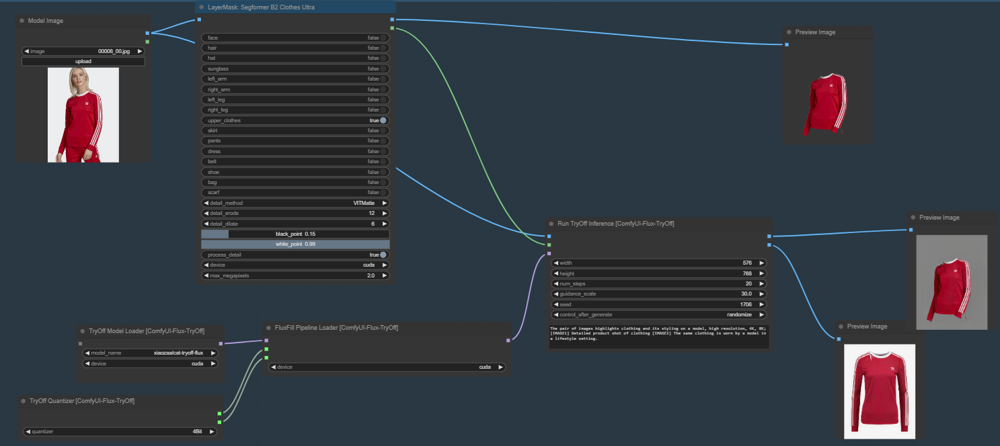

# ComfyUI-Flux-TryOff

Original Source: [catvton-flux](https://github.com/nftblackmagic/catvton-flux). I implemented their try-off inference code as ComfyUI nodes
There's a sample workflow in [Workflow](https://github.com/asutermo/ComfyUI-Flux-TryOff/tree/main/workflow) that uses SegFormer to generate the mask for you. I highly recommend this approach. Alternatively you can provide your own!

Please note, that this was tested with a 4080, and it's quite slow. You'll want a 4090 or better for performant execution as of right now.

This uses diffusers>=0.32.2.

After heavy experimenting with Try-on, it's nice to have a [Try-Off, xiaozaa/cat-tryoff-flux](https://huggingface.co/xiaozaa/cat-tryoff-flux) model to work with.
All models will download automatically unless you use the legacy 'FluxFill Model Loader'. The quantized versions will work on lower end GPUs but this has not been verified for multi-gpu runs.

To use, use the 8BitQuantized.json. You can remove the Quanitization step and it should still work.

## TODO

- Multi-gpu testing
- Optimize, optimize, optimize.
- TryOn
- Custom VAE, Text Encoders, etc.
- Use LoRA

## Issues

- SegFormer model not available (cd models && git clone https://huggingface.co/mattmdjaga/segformer_b2_clothes)
