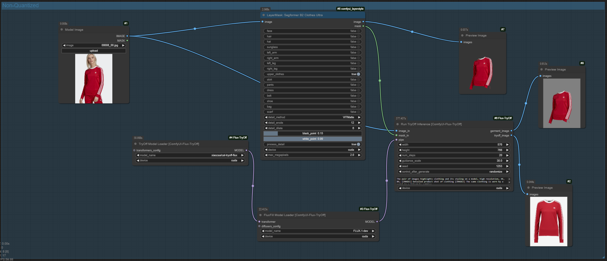

# ComfyUI-Flux-TryOff

Original Source: [catvton-flux](https://github.com/nftblackmagic/catvton-flux). I implemented their try-off inference code as ComfyUI nodes.



After heavy experimenting with Try-on, it's nice to have a [Try-Off, xiaozaa/cat-tryoff-flux](https://huggingface.co/xiaozaa/cat-tryoff-flux) model to work with.

The cat-try-off-flux model will download automatically. The Flux.1-dev model requires some effort.

1. Go to huggingface
2. Go to your settings and generate a 'write' token
3. Go to https://huggingface.co/black-forest-labs/FLUX.1-dev and accept the terms
4. Open a prompt, go to your ComfyUI installation and do the following

Windows

```bat
SET HF_TOKEN=<token_from_above>
SET HUGGING_FACE_HUB_TOKEN=<token_from_above>
```

Linux

```sh
EXPORT HF_TOKEN=<token_from_above>
EXPORT HUGGING_FACE_HUB_TOKEN=<token_from_above>
```

Finally, download FLUX.1

```sh
# Download Flux model
cd ./models/checkpoints
git lfs install
git clone https://huggingface.co/black-forest-labs/FLUX.1-dev

# Launch ComfyUI
cd ./../../
python ./main.py
```

## TODO

- Optimize, optimize, optimize.
- Allow additional models
- Formatting/consistency
- Precision
