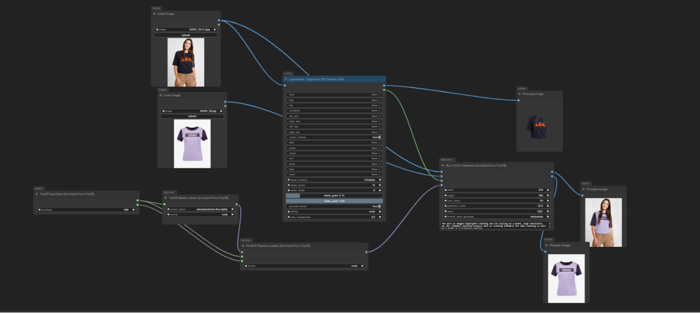

# ComfyUI-Flux-TryOff

Original Source: [catvton-flux](https://github.com/nftblackmagic/catvton-flux). I implemented their try-off inference code as ComfyUI nodes
There's a sample workflow in [Workflow](https://github.com/asutermo/ComfyUI-Flux-TryOff/tree/main/workflow) that uses SegFormer to generate the mask for you. I highly recommend this approach. Alternatively you can provide your own!

Please note, that this was tested with a 4080, and it's quite slow. You'll want a 4090 or better for performant execution as of right now.

This uses diffusers>=0.32.2.

After heavy experimenting with Try-on, it's nice to have a [Try-Off, xiaozaa/cat-tryoff-flux](https://huggingface.co/xiaozaa/cat-tryoff-flux) model to work with.

## Prerequisites

<span style="color:yellow;">This is optional. You can choose to provide your own mask, however, Segformer makes it very easy which is why my examples use this</span>

The examples I provide uses [ComfyUI LayerStyle](https://github.com/chflame163/ComfyUI_LayerStyle). You can install this via ComfyUI Manager.
You can follow the guide they provide to download models [here](https://github.com/chflame163/ComfyUI_LayerStyle?tab=readme-ov-file) or you can do the following clone command in your installation/models folder.

```sh
cd ./models
git clone https://huggingface.co/mattmdjaga/segformer_b2_clothes
```

This will acquire the necessary model for doing the clothing segmentation. Otherwise, you can create a mask region yourself.

All models will download automatically unless you use the legacy 'FluxFill Model Loader'. The quantized versions will work on lower end GPUs but this has not been verified for multi-gpu runs.

To use, use the 8BitQuantized.json. You can remove the Quanitization step and it should still work if you have sufficient GPU VRAM.




## TODO

- Multi-gpu testing
- Optimize, optimize, optimize.
- Custom VAE, Text Encoders, etc.
- Use LoRA
